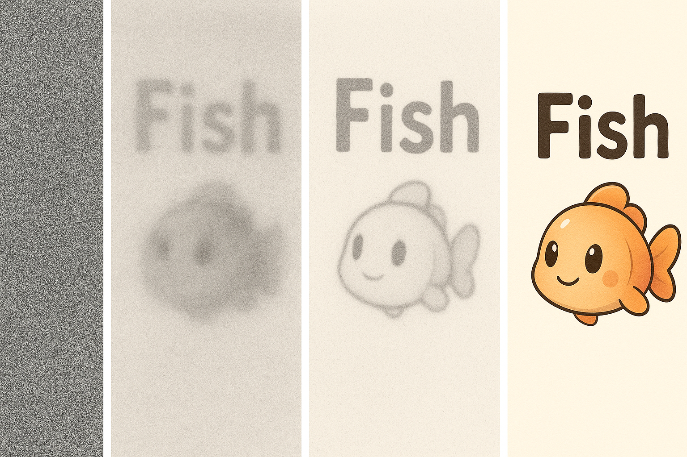

<h1 align="center">
  <a href="https://github.com/SakanaAI/L2D/">
</a><br>
<b>Large Language Models to Diffusion Finetuning</b><br>
</h1>

<p align="center">
  📚 <a href="https://arxiv.org/abs/2501.15781">[Paper]</a> |
  🤗 <a href="https://huggingface.co/SakanaAI">[Hugging Face]</a>
</p>


## Installation

We provide the full list of dependencies required to run and reproduce our experiments with the `requirements.txt` file, which can be installed into any python environment via pip:

```bash
pip install -r requirements.txt
```

## Running experiments

In the `cfgs/` folder, we provide the full list of configurations and hyper-parameters used in our work to train and evaluate L2D. In particular, the `cfgs/model/` subfolder contain model-specific configurations named as:
1. `{base_model}_lad.cfg` for L2D full diffusion path finetuning.
2.  `{base_model}_lad_lora.cfg` for L2D diffusion path finetuning with LoRA.

For instance: `llama_3.1_8b_instruct_lad_lora.cfg`.

However, you can train and evaluate any existing local models or ones hosted on [Huggingface](https://huggingface.co/) by simply modifying:

```py
pretrained_model_dir = "my/model/name/or/path"
tokenizer_dir = "my/model/name/or/path"
```

While we make use of distributed training and evaluation setups with the _deepspeed_ library, our experiments should be reproducible even with small computation buggets and a single GPU by regulating the _micro\_batch\_size_ parameters. In the `scripts/` folder we provide further scripts to facilitate running experiments with our repository.

By default, checkpoints and results are saved in the `experiments` folder.

### Finetuning Llama and Qwen models

Please, use the `scripts/run_training.sh` script feeding as the first argument the gpus available to utilize (e.g., 0 or 0,1 or 0,1,2,3... etc.) and as second argument a path to the relevant config file (e.g., `llama_3.2_1b_instruct_lad_lora.cfg`):

```bash
scripts/run_training.sh 0,1 cfgs/model/llama_3.2_1b_instruct_lad_lora.cfg
```

This training phase uses the Smoltalk dataset, 

### Evaluation

Please, use the `scripts/run_bench_full.sh` script feeding as the first argument the gpus available to utilize (e.g., 0 or 0,1 or 0,1,2,3... etc.), as second argument a path to the relevant config file (e.g., `cfgs/model/llama_3.2_1b_lad_lora.cfg`), and as third argument the path to the saved pytorch checkpoint file after training:

```bash
scripts/run_bench_full.sh 0,1 cfgs/model/llama_3.2_1b_lad_lora.cfg $CHECKPOINT_PATH
```

In our experiments we made use of the `lighteval/MATH` dataset for our results on the MATH task. Since this dataset has been temporarily removed from huggingface, our default settings foregoe this setting. Please, add an equivalent local or hosted dataset back to `cfgs\benchmark.cfg` to reactivate MATH evaluation.

### Additional notes

Running experiments requires downloading models and datasets hosted on [Huggingface](https://huggingface.co/). Hence, it requires logging into a Huggingface account with an access token, [as explained here](https://huggingface.co/docs/hub/security-tokens), with the following command:

```sh
huggingface-cli login
```

The default logging functionality saves results locally via tensorboard. Furthermore, [Weights & Biases](https://wandb.ai/) logging is also supported, please modify the provided configuration files by adding:

```py
save_wandb = True
```


## Bibtex

To cite our work, you can use the following:

```
@article{sakana2025l2d,
  title={Large Language Models to Diffusion Finetuning},
  author={Cetin, Edoardo and Zhao, Tianyu and Tang, Yujin},
  journal={arXiv preprint arXiv:2501.15781},
  year={2025}
}
```

